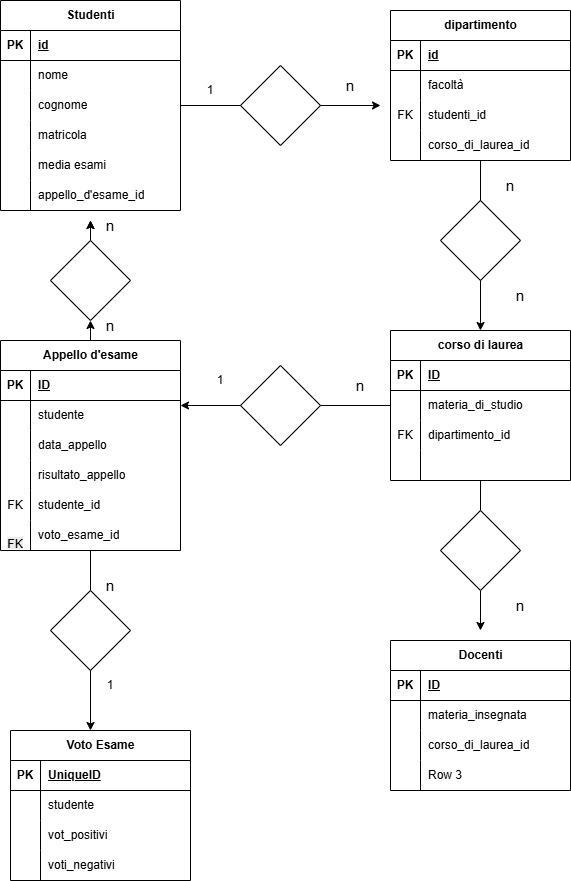

# esercizio db university

# Selezionare tutti gli studenti nati nel 1990 (160)
SELECT * FROM `db-university`.students
WHERE year(date_of_birth) = 1990;

# Selezionare tutti i corsi che valgono più di 10 crediti (479)
SELECT `cfu`, `name` FROM `db-university`.courses
WHERE cfu > 10

 # Selezionare tutti gli studenti che hanno più di 30 anni
 SELECT * FROM `db-university`.students
WHERE year(date_of_birth) < 1995;

 # Selezionare tutti i corsi del primo semestre del primo anno di un qualsiasi corso dilaurea (286)

SELECT * FROM `db-university`.courses
WHERE `PERIOD` = 'I semestre'
AND `year` = 1

 # Selezionare tutti gli appelli d'esame che avvengono nel pomeriggio (dopo le 14) del20/06/202(21)

SELECT * FROM `db-university`.exams
Where `date` = '2020-06-20' AND `hour` > '14:00:00'

 # Selezionare tutti i corsi di laurea magistrale (38)

 # Da quanti dipartimenti è composta l'università? (12)

 # Quanti sono gli insegnanti che non hanno un numero di telefono? (50)